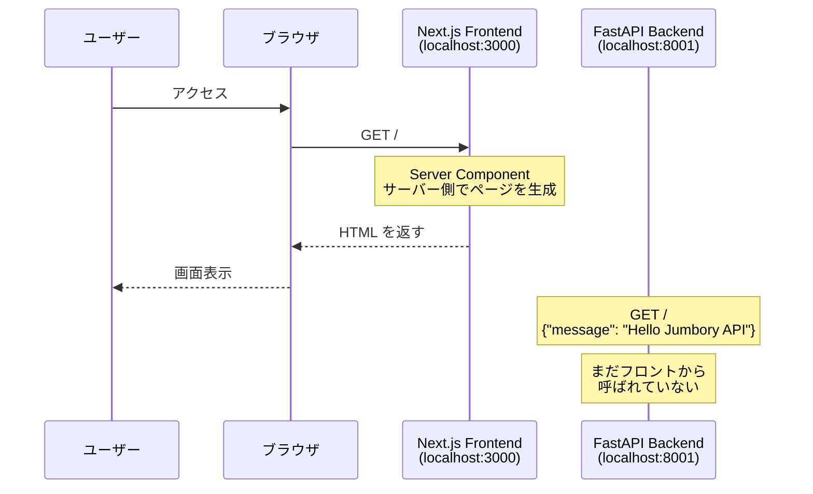
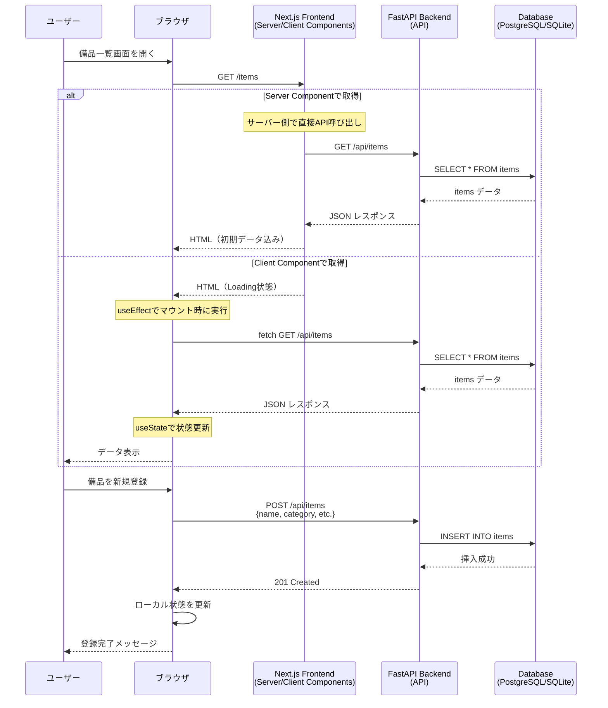

# Jumbory 備品管理アプリ - データの流れ

## 現在の構成

現在は最小構成のため、DB 接続はまだ実装されていません。以下に現状と将来の拡張を含めたデータフローを示します。

## 1. 現在の構成（初期セットアップ）



## 2. 将来の構成（備品管理機能実装後）



## 3. Next.js App Router の2つのコンポーネント種類

### Server Component（デフォルト）

- **現在の [src/app/page.tsx](../frontend/src/app/page.tsx) はこれ**
- サーバー側でレンダリング
- `useState`, `useEffect` は使えない
- 直接 API や DB にアクセス可能（バックエンド呼び出し）
- パフォーマンスが良い（初期表示が速い）

```tsx
// Server Component の例（現在の page.tsx）
export default function Home() {
  // サーバー側で実行される
  return (
    <div>
      <h1>To get started, edit the page.tsx file.</h1>
    </div>
  );
}
```

### Client Component（"use client" を宣言）

- ブラウザ側でレンダリング
- `useState`, `useEffect` が使える
- インタラクティブな UI（ボタンクリック、フォーム入力など）
- ブラウザから直接 API を呼ぶ

```tsx
// Client Component の例（まだ実装していない）
"use client";

import { useState, useEffect } from "react";

export default function ItemList() {
  const [items, setItems] = useState([]);
  const [loading, setLoading] = useState(true);

  useEffect(() => {
    // マウント時に API を呼ぶ
    fetch("http://localhost:8001/api/items")
      .then(res => res.json())
      .then(data => {
        setItems(data);
        setLoading(false);
      });
  }, []);

  if (loading) return <div>読み込み中...</div>;

  return (
    <ul>
      {items.map(item => (
        <li key={item.id}>{item.name}</li>
      ))}
    </ul>
  );
}
```

## 4. 実装パターンの使い分け

| パターン | 使用場面 | メリット |
|---------|--------|---------|
| **Server Component** | 初期表示が重要<br/>SEO が必要 | 高速、軽量、セキュア |
| **Client Component** | ユーザー操作が多い<br/>リアルタイム更新 | インタラクティブ、動的 |
| **ハイブリッド** | Server で初期データ取得<br/>Client でインタラクション | 両方のメリット |

## 5. 今後の実装予定

1. **Backend**: DB 接続（SQLAlchemy + PostgreSQL/SQLite）
2. **Backend**: CRUD エンドポイント（`/api/items`）
3. **Frontend**: Server Component で初期データ取得
4. **Frontend**: Client Component でフォーム送信・更新

## 参考: 現在のコード構成

### Backend: [backend/main.py](../backend/main.py)

```python
from fastapi import FastAPI

app = FastAPI()

@app.get("/")
def read_root() -> dict[str, str]:
    return {"message": "Hello Jumbory API"}
```

- まだ1つのエンドポイントのみ
- データベース接続なし
- フロントエンドから呼ばれていない

### Frontend: [frontend/src/app/page.tsx](../frontend/src/app/page.tsx)

```tsx
export default function Home() {
  return (
    <div className="...">
      <h1>To get started, edit the page.tsx file.</h1>
      {/* ... */}
    </div>
  );
}
```

- **Server Component**（デフォルト）
- 静的な HTML を返すのみ
- まだ API 呼び出しなし
- `useState` / `useEffect` は使っていない（使えない）

## まとめ

現在は**フロントエンドとバックエンドが独立して動作**している状態です。

次のステップでは:
1. バックエンドに DB とビジネスロジックを追加
2. フロントエンドから API を呼び出す実装を追加
3. Server Component と Client Component を使い分けて最適化

という流れで開発を進めていきます。
